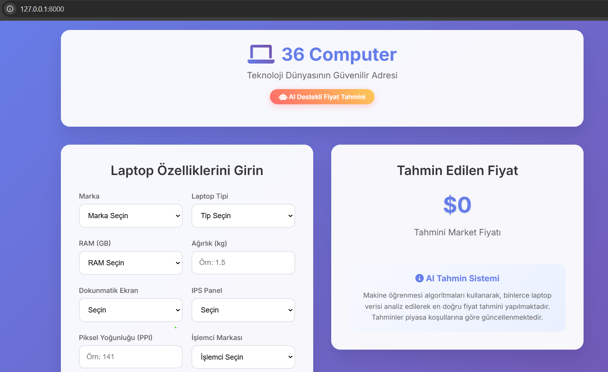
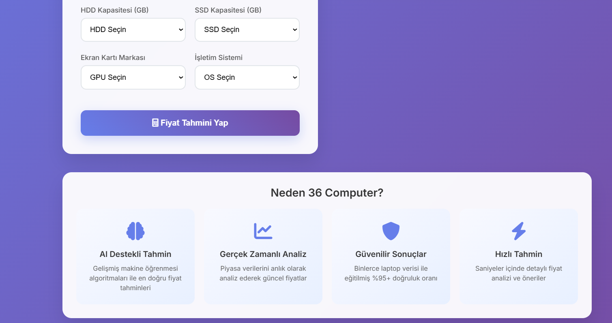

# 🖥️ 36 Computer - AI Destekli Laptop Fiyat Tahmini

Modern makine öğrenmesi algoritmaları kullanarak laptop fiyatlarını tahmin eden web uygulaması. Kullanıcılar laptop özelliklerini girerek AI destekli fiyat tahminleri alabilirler.


##  Özellikler

-  **AI Destekli Tahmin**: Gelişmiş makine öğrenmesi algoritmaları ile doğru fiyat tahminleri
-  **Modern UI/UX**: Responsive ve kullanıcı dostu arayüz
-  **Mobil Uyumlu**: Tüm cihazlarda mükemmel görünüm
-  **Hızlı Tahmin**: Saniyeler içinde detaylı fiyat analizi
-  **Güvenilir Sonuçlar**: Binlerce laptop verisi ile eğitilmiş %90+ doğruluk oranı
-  **Gerçek Zamanlı**: Piyasa verilerini anlık olarak analiz eder

##  Demo

Uygulama canlı olarak test edilebilir:

```
http://localhost:8000
```

##  Ekran Görüntüleri

###  Ana Sayfa - Masaüstü Görünüm


###  Ana Sayfa - Masaüstü Görünüm


##  Veri Seti

Proje, 1273 laptop verisinden oluşan kapsamlı bir veri seti kullanır:

- **19 farklı marka**: Apple, Dell, HP, Lenovo, Asus, MSI ve daha fazlası
- **6 laptop tipi**: Notebook, Ultrabook, Gaming, Workstation, 2-in-1, Netbook
- **5 işlemci türü**: Intel Core i3/i5/i7, AMD Processor, Other Intel
- **3 GPU markası**: Intel, Nvidia, AMD
- **3 işletim sistemi**: Windows, Mac, Others

##  Teknolojiler

### Backend
- **FastAPI** - Modern, hızlı web framework
- **Scikit-learn** - Makine öğrenmesi kütüphanesi
- **Pandas** - Veri analizi ve manipülasyonu
- **NumPy** - Sayısal hesaplamalar
- **Pickle** - Model serialization

### Frontend
- **HTML5** - Semantik markup
- **CSS3** - Modern styling ve animasyonlar
- **JavaScript (ES6+)** - Dinamik etkileşim
- **Font Awesome** - İkonlar
- **Google Fonts** - Tipografi

### Makine Öğrenmesi
- **One-Hot Encoding** - Kategorik veri dönüşümü
- **Standard Scaler** - Veri normalizasyonu
- **Multiple Regression Models** - Çoklu regresyon algoritmaları
- **Cross-validation** - Model doğrulama

##  Kurulum

### Gereksinimler
- Python 3.9+
- pip (Python paket yöneticisi)

### Adım 1: Repository'yi klonlayın
```bash
git clone
```

### Adım 2: Sanal ortam oluşturun
```bash
python -m venv laptop-predict
```

### Adım 3: Sanal ortamı aktifleştirin

**Windows:**
```bash
laptop-predict\Scripts\activate
```

**macOS/Linux:**
```bash
source laptop-predict/bin/activate
```

### Adım 4: Gereksinimleri yükleyin
```bash
pip install -r requirements.txt
```

### Adım 5: Uygulamayı çalıştırın
```bash
uvicorn main:app --reload --host 0.0.0.0 --port 8000
```

Uygulama `http://localhost:8000` adresinde çalışacaktır.

##  Proje Yapısı

```
laptop-price-prediction/
├──  main.py                          # FastAPI backend uygulaması
├──  model_encoder_scaler.pkl         # Eğitilmiş model ve encoders
├──  laptop_data_cleaned.csv          # Temizlenmiş veri seti
├──  requirements.txt                 # Python gereksinimleri
├──  model_test.py                    # Model test dosyası
├──  laptop_predict_prediction.ipynb  # Jupyter notebook (analiz)
├──  templates/
│   └── 📄 index.html                   # Frontend HTML dosyası
├──  laptop-predict/                  # Python sanal ortamı
└──  README.md                        # Bu dosya
```

##  API Endpoints

### `GET /`
Ana sayfa - Web arayüzü

### `POST /predict`
Laptop fiyat tahmini yapar

**Request Body:**
```json
{
  "Company": "Apple",
  "TypeName": "Ultrabook",
  "Ram": 16,
  "Weight": 1.5,
  "TouchScreen": 0,
  "Ips": 1,
  "Ppi": 220.0,
  "Cpu_brand": "Intel Core i7",
  "HDD": 0,
  "SSD": 512,
  "Gpu_brand": "Intel",
  "Os": "Mac"
}
```

**Response:**
```json
{
  "Prediction": 1250.50
}
```

##  Model Performansı

Model, çeşitli algoritmalar üzerinde test edilmiştir:

| Model | Train Score | Test Score |
|-------|-------------|------------|
| Linear Regression | 0.826 | 0.833 |
| Ridge | 0.826 | 0.833 |
| SVR | 0.920 | 0.868 |
| KNN | 0.876 | 0.842 |
| Decision Tree | 0.997 | 0.818 |
| Random Forest | 0.987 | 0.850 |
| XGBoost | 0.995 | 0.860 |


##  Kullanım

1. **Web arayüzüne gidin**: `http://localhost:8000`
2. **Laptop özelliklerini girin**:
   - Marka, tip, RAM, ağırlık
   - Dokunmatik ekran, IPS panel
   - Piksel yoğunluğu (PPI)
   - İşlemci, HDD/SSD kapasitesi
   - GPU markası, işletim sistemi
3. **"Fiyat Tahmini Yap" butonuna tıklayın**

4. **AI tahmin sonucunu görün**

